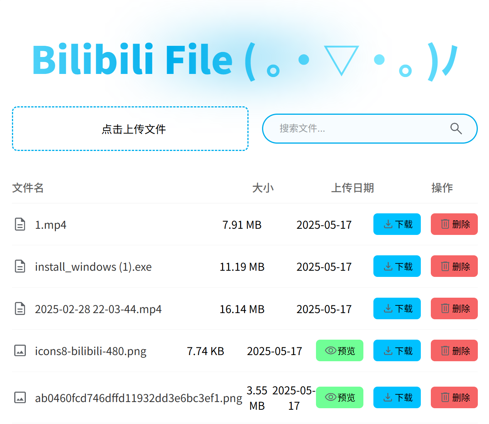

## 一款基于B站的文件托管插件。

<!-- PROJECT SHIELDS -->

[![Contributors][contributors-shield]][contributors-url]
[![Forks][forks-shield]][forks-url]
[![Stargazers][stars-shield]][stars-url]
[![Issues][issues-shield]][issues-url]
[![MIT License][license-shield]][license-url]
[![LinkedIn][linkedin-shield]][linkedin-url]

<!-- PROJECT LOGO -->

  
  <h1 align="center">Bilibili File</h1>
  

    <a href="https://github.com/WJZ-P/Bilibili-File">查看Demo</a>
    ·
    <a href="https://github.com/WJZ-P/Bilibili-File/issues">报告Bug</a>
    ·
    <a href="https://github.com/WJZ-P/Bilibili-File/issues">提出新特性</a>
  

  

<h2 align="center">"歌唱着BILIBILI 跟我一起 探寻这美丽的天地"</h2>

## 目录

- [Bilibili File](#projectname)
    - [目录](#目录)
        - [重要声明](#重要声明)
        - [上手指南](#上手指南)
            - [前置要求](#前置要求)
            - [**插件安装步骤**](#安装步骤)
        - [**使用方法**](#使用方法)
        - [版权说明](#版权说明)
        

## 重要声明

#### 本项目仅供**交流学习**使用，**禁止用于一切非法用途**！任何问题概不负责。(｡•́︿•̀｡)

## 上手指南

###### 前置要求

1. 请先安装油猴(Tampermonkey)。什么是油猴？https://www.tampermonkey.net
2. 项目的greasefork地址：https://greasyfork.org/zh-CN/scripts/536378-bilibili-file ，可以从此下载

###### 安装步骤

1. 下载release中的最新版本
2. 在油猴中添加新插件，选择该插件，后缀为.js

# 使用方法

## 1. 打开B站主页

  

点击投稿旁的传输。

## 2. 进入主界面，根据界面指引进行交互

    

## 3. 具体操作：
- ### 上传文件
  - #### 支持上传20M内(未来实现分片上传)的任意文件，如果文件是图片，支持点击预览。
- ### 下载文件
  - #### 在当前页面内，点击右侧的下载即可完成文件的下载。
  - #### 点击文件名即可直接复制链接。

## 版权说明

该项目签署了EPL-2.0 license
授权许可，详情请参阅 [LICENSE](https://github.com/WJZ-P/Bilibili-File/blob/main/LICENSE)

## 📝 To Do List

- [x] 链接分 享
- [ ] 分片传输，突破20M限制

## ⭐ Star 历史

<!-- links -->

[your-project-path]:WJZ-P/Bilibili-File

[contributors-shield]: https://img.shields.io/github/contributors/WJZ-P/Bilibili-File.svg?style=flat-square

[contributors-url]: https://github.com/WJZ-P/Bilibili-File/graphs/contributors

[forks-shield]: https://img.shields.io/github/forks/WJZ-P/Bilibili-File.svg?style=flat-square

[forks-url]: https://github.com/WJZ-P/Bilibili-File/network/members

[stars-shield]: https://img.shields.io/github/stars/WJZ-P/Bilibili-File.svg?style=flat-square

[stars-url]: https://github.com/WJZ-P/Bilibili-File/stargazers

[issues-shield]: https://img.shields.io/github/issues/WJZ-P/Bilibili-File.svg?style=flat-square

[issues-url]: https://img.shields.io/github/issues/WJZ-P/Bilibili-File.svg

[license-shield]: https://img.shields.io/github/license/WJZ-P/Bilibili-File.svg?style=flat-square

[license-url]: https://github.com/WJZ-P/Bilibili-File/blob/main/LICENSE

[linkedin-shield]: https://img.shields.io/badge/-LinkedIn-black.svg?style=flat-square&logo=linkedin&colorB=555

[linkedin-url]: https://linkedin.com/in/shaojintian

[//]: # (不知道写点啥)